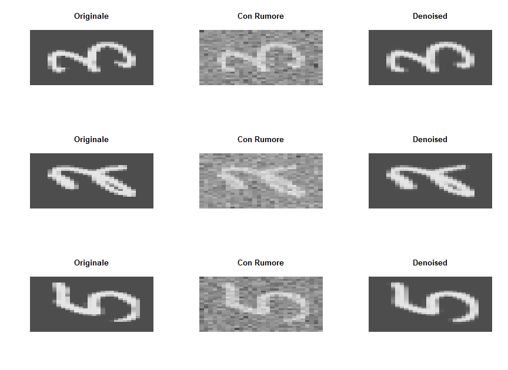
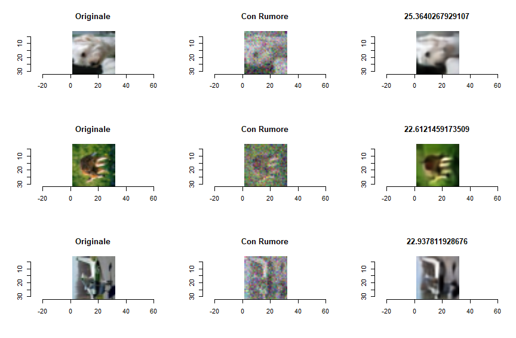
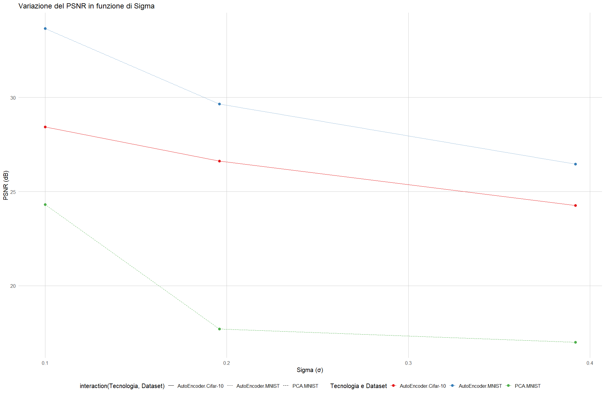

# 📦 Denoising Autoencoders in R (Keras/TensorFlow)

## 🇬🇧 English Version

> Image denoising using convolutional autoencoders implemented in R with `keras` and `tensorflow`, leveraging GPU acceleration.

This project demonstrates how to implement a convolutional autoencoder to denoise images corrupted with **Gaussian noise**, using `MNIST` (grayscale) and `CIFAR-10` (RGB) datasets.  
It was developed as part of a university exam project.

---

## 🔍 Overview

- Language: **R**
- Framework: **Keras + TensorFlow**
- Architecture: **Symmetric Convolutional AutoEncoder**
- Datasets:
  - [MNIST](http://yann.lecun.com/exdb/mnist/) (28×28 BW)
  - [CIFAR-10](https://www.cs.toronto.edu/~kriz/cifar.html) (32×32 RGB)
- Noise: **Gaussian Noise**, various levels of σ
- Evaluation metrics: **PSNR** and **SSIM**
- Goal: reconstruct images with high fidelity to the original

---

## ⚙️ Requirements

Make sure you have:

- **R ≥ 4.3**
- **Conda** with an environment containing R + TensorFlow
- GPU with CUDA support (optional but recommended for faster training)

---

## 🧠 AutoEncoder Model

- **Encoder**: 3 convolutions + max pooling
- **Dropout**: to reduce overfitting risk
- **Latent space**
- **Decoder**: 3 transposed convolutions + upsampling
- **Output**: `tanh`, with images normalized in `[-1, 1]`

---

## 🖼️ Visual Results

### MNIST - σ = 0.392 - PSNR = 26.47dB  


### CIFAR10 - σ = 0.392 - PSNR = 24.32dB  


---

## 📈 Experimental Results

| Dataset   | Sigma (σ) | PSNR     | Epochs |
|-----------|------------|----------|--------|
| MNIST     | 0.1        | 33.66 dB | 118    |
| MNIST     | 0.196      | 29.66 dB | 256    |
| MNIST     | 0.392      | 26.47 dB | 175    |
| CIFAR-10  | 0.1        | 28.44 dB | 169    |
| CIFAR-10  | 0.196      | 26.63 dB | 200    |
| CIFAR-10  | 0.392      | 24.32 dB | 129    |

Sigma represents the noise intensity. Values 0.196 and 0.392 correspond to standard deviations of 25 and 50 respectively, scaled as `(sigma / 256) * 2` due to normalization in the `[-1, 1]` range.

> ⚠️ Values are averaged over 10,000 test images using `mean PSNR`.

---

## 📂 Repository Structure

```
.
├── mnist_denoising.R
├── cifar10_denoising.R
├── results/
│   ├── ...
├── LICENSE
└── README.md
```

> A detailed report and additional statistical analyses (PCA, statistical tests, etc.) were produced, but are not included in this repo.

---

### Hardware & Development Environment

- GPU: **NVIDIA RTX 4070 Super**
- CPU: Intel Core i5 14600KF
- Training time MNIST: ~8ms/step
- Others: CUDA and cuDNN

---

### Syntetic Plot (All Results)




---

## 📄 License

This project is licensed under the **MIT** License. See the [LICENSE](LICENSE) file for details.

---

# 🇮🇹 Versione Italiana

> Denoising di immagini mediante reti neurali convoluzionali (AutoEncoder) implementate in R, usando `keras` e `tensorflow` con supporto GPU.

Questo progetto mostra come realizzare un modello di autoencoder per il denoising di immagini contaminate da **rumore gaussiano**, con dataset `MNIST` (immagini BW) e `CIFAR-10` (immagini RGB).  
In particolare si tratta del frutto del lavoro di alcuni mesi, per la preparazione dell'esame di un corso universitario.

---

## 🔍 Overview

- Linguaggio: **R**
- Framework: **Keras + TensorFlow**
- Architettura: **AutoEncoder convoluzionale simmetrico**
- Dataset:
  - [MNIST](http://yann.lecun.com/exdb/mnist/) (28×28 BW)
  - [CIFAR-10](https://www.cs.toronto.edu/~kriz/cifar.html) (32×32 RGB)
- Rumore: **Gaussian Noise**, con vari livelli di σ
- Metriche di valutazione: **PSNR** e **SSIM**
- Obiettivo: restituire immagini ricostruite con alta fedeltà rispetto all’originale

---

## ⚙️ Requisiti

Assicurati di avere:

- **R ≥ 4.3**
- **Conda** con un environment R + TensorFlow
- GPU con supporto CUDA (opzionale, ma consigliato per un allenamento della rete più veloce)

---

## 🧠 Modello di AutoEncoder

- **Encoder**: 3 convoluzioni + max pooling
- **Dropout**: diminuizione del rischio di overfitting
- **Latent space**
- **Decoder**: 3 convoluzioni trasposte + upsampling
- **Output**: `tanh`, immagini normalizzate in `[-1, 1]`

---

## 🖼️ Risultati visivi

### MNIST - σ = 0.392 - PSNR = 26.47dB  


### CIFAR10 - σ = 0.392 - PSNR = 24.32dB  


---

## 📈 Risultati durante sperimentazioni

| Dataset   | Sigma (σ) | PSNR     | Epochs |
|-----------|------------|----------|--------|
| MNIST     | 0.1        | 33.66 dB | 118    |
| MNIST     | 0.196      | 29.66 dB | 256    |
| MNIST     | 0.392      | 26.47 dB | 175    |
| CIFAR-10  | 0.1        | 28.44 dB | 169    |
| CIFAR-10  | 0.196      | 26.63 dB | 200    |
| CIFAR-10  | 0.392      | 24.32 dB | 129    |

Sigma rappresenta l'intensità di rumore applicato alle immagini. Il rumore in questione è bianco additivo, ovvero aggiunge un noise realistico (no pattern o strutture spaziali particolari), aggiungendo il valore di ogni pixel ad un epsilon campionato da una distribuzione normale standard centrata nello zero e con varianza uguale proprio al sigma.  
I valori 0.196 e 0.392 sono equivalenti ad un sigma, rispettivamente, uguale a 25 e 50, calcolato come: (sigma / 256) * 2, in modo da considerare che le immagini sono normalizzate in un range di 2 ([-1, 1])

> ⚠️ I valori sono mediati su 10.000 immagini test, calcolati tramite `mean PSNR`

---

## 📂 Struttura del repository

```
.
├── mnist_denoising.R
├── cifar10_denoising.R
├── results/
│   ├── ...
├── LICENSE
└── README.md
```

> Per questo progetto è stato elaborato anche un report/tesina, con presentazione, oltre ad una serie di analisi statistiche aggiuntive (PCA, test statistici, ...) omessi in questo repo.

---

### Setup hardware e ambiente di sviluppo

- GPU: **NVIDIA RTX 4070 Super**
- CPU: Intel Core i5 14600KF
- Training time MNIST: ~8ms/step
- Others: CUDA e cuDNN

---

### Grafico Sintetico (Tutti i Risultati)


---

## 📄 Licenza

Questo progetto è distribuito sotto licenza **MIT**. Vedi il file [LICENSE](LICENSE) per i dettagli.
