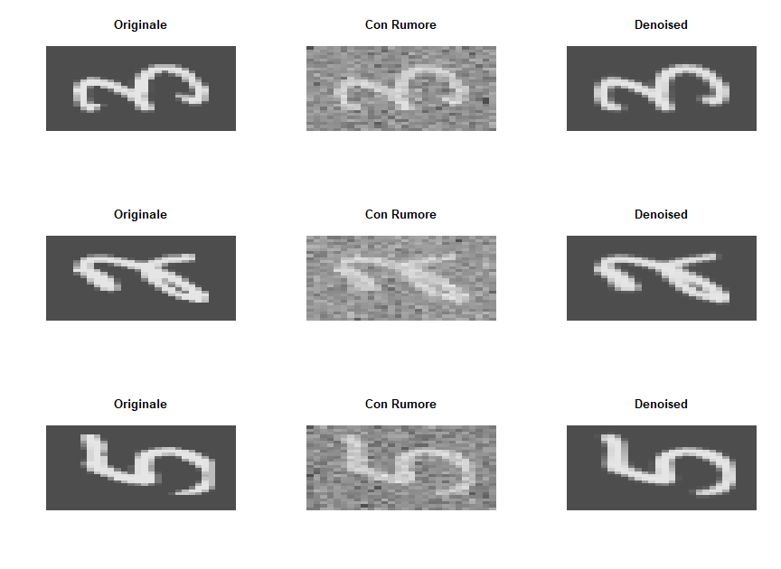
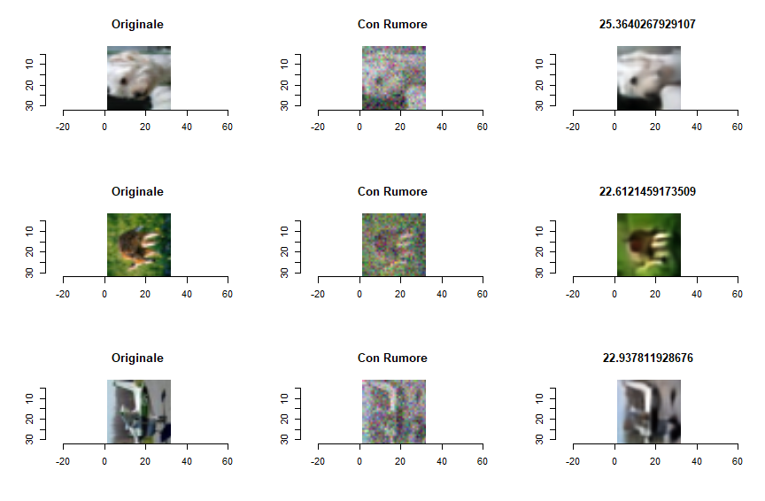

# 📦 Denoising Autoencoders in R (Keras/TensorFlow)

🇮🇹 *Denoising di immagini mediante reti neurali convoluzionali (AutoEncoder) implementate in R, usando `keras` e `tensorflow` con supporto GPU. (Progetto per esame Universitario)*  
🇬🇧 *Image denoising using convolutional autoencoders implemented in R with `keras` and `tensorflow`, leveraging GPU acceleration. (University Exam Project)*

---

## 🔍 Overview

🇮🇹 Modello di autoencoder convoluzionale simmetrico per il denoising di immagini affette da rumore gaussiano additivo, sperimentato su dataset MNIST e CIFAR-10.  
🇬🇧 Symmetric convolutional autoencoder model for image denoising under additive Gaussian noise, tested on MNIST and CIFAR-10 datasets.

**Tecnologie / Technologies:**
- R con keras e tensorflow
- GPU: NVIDIA RTX 4070 Super
- Metriche / Metrics: PSNR, SSIM
- Rumore / Noise: Gaussian Noise (σ = 0.1–0.392)

---

## 🖼️ Risultati Visivi / Visual Results

### MNIST - σ = 0.392 - PSNR = 26.47 dB

### CIFAR-10 - σ = 0.392 - PSNR = 24.32 dB

📁 *Altri risultati sono disponibili nella cartella `results/` del repository.*  
📁 *Other results are available in the `results/` folder of the repository.*

---

## 📈 Risultati Quantitativi / Quantitative Results

| Dataset   | Sigma (σ) | PSNR     | Epochs |
|-----------|------------|----------|--------|
| MNIST     | 0.1        | 33.66 dB | 118    |
| MNIST     | 0.196      | 29.66 dB | 256    |
| MNIST     | 0.392      | 26.47 dB | 175    |
| CIFAR-10  | 0.1        | 28.44 dB | 169    |
| CIFAR-10  | 0.196      | 26.63 dB | 200    |
| CIFAR-10  | 0.392      | 24.32 dB | 129    |

🇮🇹 *Sigma rappresenta l'intensità del rumore gaussiano applicato. I valori 0.196 e 0.392 equivalgono a σ=25 e σ=50, normalizzati su immagini in range [-1,1].*  
🇬🇧 *Sigma represents the intensity of the Gaussian noise applied. Values 0.196 and 0.392 correspond to σ=25 and σ=50, normalized over images in range [-1,1].*

---

## 🔗 Repository GitHub

👉 [🇮🇹 Vai al repository](https://github.com/gabrielelobosco/denoising-autoencoder-r)  
👉 [🇬🇧 View the repository on GitHub](https://github.com/gabrielelobosco/denoising-autoencoder-r)

---

## 🖥️ Setup hardware e ambiente / Environment Setup

- GPU: NVIDIA RTX 4070 Super
- CPU: Intel Core i5 14600KF
- Training time MNIST: ~8ms/step
- Others: CUDA e cuDNN

---

## 📄 Licenza / License

🇮🇹 Questo progetto è distribuito sotto licenza **MIT**. Vedi il file [LICENSE](LICENSE) per i dettagli.  
🇬🇧 This project is licensed under the **MIT** license. See [LICENSE](LICENSE) for details.
